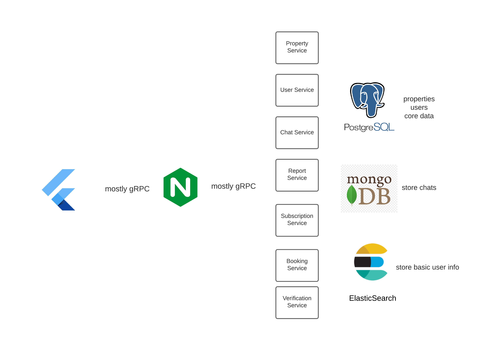

# Away Backend

A cloud independent AirBnb like system. Allows you to discover properties to rent anywhere in the world and post your own properties. Users can message each other in-app.
> Video series here: [Away Playlist](https://youtube.com/playlist?list=PLUs1QA1OhHZRVLDG9xz9MC_8-h2ROYZZQ)

Architecture
----

Hosting
----
The project can be self-hosted (VPS) or deployed to a cloud provider

